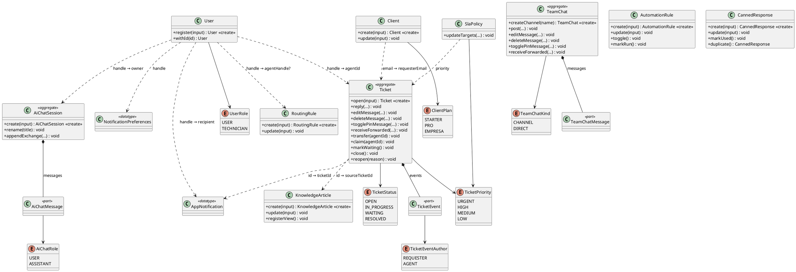

# SuppAgent — modelo de dados e domínio (mapa UML)

Documento de referência para montar o diagrama UML de classes: **tabelas Prisma**, **atributos**, **enumerações**, **classes de domínio** e **métodos**.

Fonte: `apps/backend/prisma/schema.prisma` + `apps/backend/src/modules/*/domain`.

### Convenções UML usadas aqui

| Notação | Significado no SuppAgent |
|---|---|
| «entity» / tabela | Modelo Prisma persistido |
| «aggregate» | Raiz de agregado no domínio |
| «part» | Parte composta (cascade) |
| «enumeration» | Enum Prisma / união TypeScript |
| `+` | público (API do domínio) |
| `<<create>>` | factory estática |
| Composição `◆` | FK + `onDelete: Cascade` |
| Associação `---` | vínculo lógico (handle, e-mail, id) **sem FK** |

Não há **herança** entre entidades. Só `Error` subclasses.

Métodos comuns de reconstituição (`reconstitute`) existem em quase todas as classes: recriam o objeto a partir do banco (não são regra de negócio). Getters espelham atributos — listados de forma compacta.

---

## 1. Enumerações («enumeration»)

### `TicketStatus`
| Literal Prisma | Domínio TS | Significado |
|---|---|---|
| `OPEN` | `open` | Aberto, ainda sem andamento efetivo |
| `IN_PROGRESS` | `in_progress` | Em atendimento |
| `WAITING` | `waiting` | Aguardando cliente / retorno |
| `RESOLVED` | `resolved` | Encerrado |

Usado em: `Ticket.status`.

### `TicketPriority`
| Literal Prisma | Domínio TS | Significado |
|---|---|---|
| `URGENT` | `urgent` | Urgente |
| `HIGH` | `high` | Alta |
| `MEDIUM` | `medium` | Média |
| `LOW` | `low` | Baixa |

Usado em: `Ticket.priority`, `SlaPolicy.priority` (1 política por prioridade).

### `UserRole`
| Literal Prisma | Domínio TS | Significado |
|---|---|---|
| `USER` | `user` / `usuario` (HTTP) | Usuário normal (sem handle de agente) |
| `TECHNICIAN` | `technician` / `tecnico` | Técnico; exige `handle` |

Usado em: `User.role`.

### `ClientPlan`
| Literal Prisma | Domínio TS | Significado |
|---|---|---|
| `STARTER` | `starter` | Plano inicial |
| `PRO` | `pro` | Plano intermediário |
| `EMPRESA` | `empresa` | Plano corporativo |

Usado em: `Client.plan`.

### `TicketEventAuthor`
| Literal Prisma | Domínio TS | Significado |
|---|---|---|
| `REQUESTER` | `requester` | Mensagem do solicitante |
| `AGENT` | `agent` | Mensagem / ação do agente |

Usado em: `TicketEvent.author`.

### `TeamChatKind`
| Literal Prisma | Domínio TS | Significado |
|---|---|---|
| `CHANNEL` | `channel` | Canal (vários participantes) |
| `DIRECT` | `direct` | Conversa direta |

Usado em: `TeamChat.kind`.

### `AiChatRole`
| Literal Prisma | Domínio TS | Significado |
|---|---|---|
| `USER` | `user` | Mensagem do agente no chat com a IA |
| `ASSISTANT` | `assistant` | Resposta da IA |

Usado em: `AiChatMessage.role`.

### Enumerações só de domínio (não são enum Prisma)

| Nome | Valores | Onde |
|---|---|---|
| `TicketFilter` | `todos`, `meus`, `naoatribuidos`, `urgentes` | listagem de chamados |
| `NotificationType` | `ticket_assigned`, `ticket_opened`, `ticket_reopened`, `ticket_urgent` | tipo de notificação |
| `SlaTone` | `ok`, `warn`, `breach` | relógio SLA (calculado) |
| `RoutingTone` | `high`, `mid`, `low` | confiança do roteamento |
| `RoutingStatus` | `aplicado`, `pendente`, `revisao` | estado da sugestão no board |

---

## 2. Tabelas e classes

### 2.1 `users` → classe `User`

**Para que serve:** pessoas do painel (equipe). Técnicos têm `handle` usado em todo o sistema.

| Atributo | Tipo | Significado |
|---|---|---|
| `id` | UUID | Identificador |
| `name` | String | Nome de exibição |
| `email` | String «unique» | Login / contato |
| `handle` | String? «unique» | Apelido do agente (`c.reis`); obrigatório se técnico |
| `role` | UserRole | Perfil |
| `createdAt` / `updatedAt` | DateTime | Auditoria |

**Métodos de domínio (`User`):**

| Método | Tipo | Descrição UML |
|---|---|---|
| `register(input)` | `<<create>>` static | Cria usuário validando e-mail, papel e handle |
| `reconstitute(props)` | static | Hidrata do banco |
| `withId(id)` | + | Atribui id após persistir (inserção) |
| `isNew` | get | `true` se ainda sem id |

Getters: `id`, `name`, `email`, `handle`, `role`, `createdAt`.

**Associações lógicas:** `handle` ← `Ticket.agentId`, `RoutingRule.agentHandle`, `Notification.recipientHandle`, `AiChatSession.ownerHandle`, `TeamChatMessage.authorHandle`.

---

### 2.2 `clients` → classe `Client`

**Para que serve:** cadastro de clientes (contas). Chamados ligam-se pelo **e-mail**, não por FK.

| Atributo | Tipo | Significado |
|---|---|---|
| `id` | UUID | Identificador |
| `name` | String | Nome da pessoa / contato |
| `company` | String? | Empresa |
| `plan` | ClientPlan | Plano contratado |
| `email` | String «unique» | Chave de vínculo com tickets |
| `phone` | String? | Telefone |
| `tags` | String[] | Etiquetas livres |
| `createdAt` / `updatedAt` | DateTime | Auditoria |

**Métodos (`Client`):**

| Método | Tipo | Descrição |
|---|---|---|
| `create(input)` | `<<create>>` static | Cadastra cliente (normaliza e-mail/tags) |
| `reconstitute(props)` | static | Hidrata do banco |
| `update(input)` | + | Altera nome, empresa, plano, e-mail, telefone, tags |

Getters: `id`, `name`, `company`, `plan`, `email`, `phone`, `tags`, `createdAt`, `updatedAt`.

**Associação lógica:** `Client.email` ↔ `Ticket.requesterEmail`.

---

### 2.3 `tickets` → classe `Ticket` «aggregate»

**Para que serve:** chamado de suporte — núcleo do sistema.

| Atributo | Tipo | Significado |
|---|---|---|
| `id` | Int (auto) | Número do chamado (`#4471`) |
| `subject` | String | Assunto |
| `status` | TicketStatus | Estado do ciclo de vida |
| `priority` | TicketPriority | Prioridade / SLA |
| `agentId` | String? | Handle do técnico (`null` = livre) |
| `category` | String | Categoria (financeiro, acesso…) |
| `requesterName` | String | Nome do solicitante (denormalizado) |
| `requesterEmail` | String | E-mail do solicitante |
| `createdAt` / `updatedAt` | DateTime | Abertura / última mudança |
| `events` | TicketEvent[] | Composição — histórico |

**Métodos (`Ticket`):**

| Método | Descrição |
|---|---|
| `open(input)` `<<create>>` | Abre chamado + 1ª mensagem do solicitante |
| `reconstitute(props)` | Hidrata do banco |
| `reply(text, isInternalNote, at?, replyToId?)` | Resposta ou nota interna; pode mudar status para andamento |
| `editMessage(messageId, text, at?)` | Edita mensagem do histórico |
| `deleteMessage(messageId, at?)` | Soft-delete da mensagem |
| `togglePinMessage(messageId, at?)` | Fixa / desafixa |
| `receiveForwarded({ text, fromName, … })` | Recebe mensagem encaminhada |
| `transfer(agentId, at?)` | Atribui / transfere técnico |
| `claim(agentId, at?)` | Assume chamado livre |
| `markWaiting(at?)` | Marca aguardando |
| `close(at?)` | Encerra (resolved) |
| `reopen(reason, at?)` | Reabre com justificativa |
| `authorDisplayName(entry)` | Nome de exibição do autor da mensagem |
| `withId(id)` | Define id após insert |

Getters: `id`, `isNew`, `subject`, `status`, `priority`, `agentId`, `category`, `requesterName`, `requesterEmail`, `createdAt`, `history`.

**Composição:** `Ticket ◆── TicketEvent` (cascade).

---

### 2.4 `ticket_events` → tipo `TicketHistoryEntry` «part»

**Para que serve:** cada mensagem/nota/evento da timeline do chamado. **Não** é classe de domínio independente — vive dentro de `Ticket`.

| Atributo | Tipo | Significado |
|---|---|---|
| `id` | UUID | Id da mensagem |
| `ticketId` | Int | FK → `tickets.id` |
| `occurredAt` | DateTime | Quando ocorreu no chat |
| `text` | String | Conteúdo |
| `isInternalNote` | Boolean | Nota só da equipe |
| `author` | TicketEventAuthor | Solicitante ou agente |
| `deletedAt` | DateTime? | Soft-delete |
| `editedAt` | DateTime? | Última edição |
| `pinnedAt` | DateTime? | Fixada |
| `replyToId` | String? | Resposta a outra mensagem (sem FK) |
| `forwardedFromName` | String? | Origem do encaminhamento |
| `createdAt` / `updatedAt` | DateTime | Auditoria |

**Métodos próprios:** nenhum. Operações via `Ticket.reply / editMessage / deleteMessage / …`.

---

### 2.5 `knowledge_articles` → classe `KnowledgeArticle`

**Para que serve:** artigos da base de conhecimento.

| Atributo | Tipo | Significado |
|---|---|---|
| `id` | UUID | Identificador |
| `title` | String | Título |
| `category` | String | Categoria |
| `body` | String | Conteúdo |
| `tags` | String[] | Tags |
| `published` | Boolean | Publicado vs rascunho |
| `authorName` | String | Autor (texto) |
| `views` | Int | Visualizações |
| `usefulPercent` | Int | % utilidade |
| `ticketsAvoided` | Int | Chamados evitados (métrica) |
| `sourceTicketId` | Int? «unique» | Chamado de origem (sem FK) |
| `createdAt` / `updatedAt` | DateTime | Auditoria |

**Métodos (`KnowledgeArticle`):**

| Método | Descrição |
|---|---|
| `create(input)` `<<create>>` | Cria artigo |
| `reconstitute(props)` | Hidrata |
| `update(input)` | Altera título, categoria, corpo, tags, published |
| `registerView(at?)` | Incrementa `views` |
| `withId(id)` | Define id pós-insert |

---

### 2.6 `team_chats` → classe `TeamChat` «aggregate»

**Para que serve:** canais / DMs da equipe.

| Atributo | Tipo | Significado |
|---|---|---|
| `id` | UUID | Identificador |
| `name` | String | Nome do canal |
| `kind` | TeamChatKind | Canal ou direto |
| `createdAt` / `updatedAt` | DateTime | Auditoria |
| `messages` | TeamChatMessage[] | Composição |

**Métodos (`TeamChat`):**

| Método | Descrição |
|---|---|
| `createChannel(name, now?)` `<<create>>` | Cria canal |
| `reconstitute(props)` | Hidrata |
| `post(text, authorHandle, authorName, at?, replyToId?)` | Envia mensagem |
| `editMessage(messageId, text, at?)` | Edita |
| `deleteMessage(messageId, at?)` | Soft-delete |
| `togglePinMessage(messageId, at?)` | Fixa / desafixa |
| `receiveForwarded({ text, fromName, … })` | Recebe encaminhamento |

---

### 2.7 `team_chat_messages` → tipo `TeamChatMessage` «part»

**Para que serve:** mensagem dentro do bate-papo. Parte do agregado `TeamChat`.

| Atributo | Tipo | Significado |
|---|---|---|
| `id` | UUID | Id |
| `chatId` | String | FK → `team_chats` |
| `occurredAt` | DateTime | Horário no chat |
| `text` | String | Conteúdo |
| `authorHandle` / `authorName` | String | Quem enviou |
| `deletedAt` / `editedAt` / `pinnedAt` | DateTime? | Soft meta |
| `replyToId` | String? | Thread (sem FK) |
| `forwardedFromName` | String? | Encaminhamento |
| `createdAt` / `updatedAt` | DateTime | Auditoria |

**Métodos próprios:** nenhum (via `TeamChat`).

---

### 2.8 `notifications` → tipo `AppNotification`

**Para que serve:** avisos no sino do topbar. **Não** há classe rica — tipo + serviços de aplicação.

| Atributo | Tipo | Significado |
|---|---|---|
| `id` | UUID | Id |
| `recipientHandle` | String | Agente destinatário |
| `type` | String / NotificationType | Tipo do evento |
| `title` / `body` | String | Texto exibido |
| `ticketId` | Int? | Chamado relacionado |
| `readAt` | DateTime? | `null` = não lida |
| `createdAt` / `updatedAt` | DateTime | Auditoria |

**Função de domínio relacionada:**

| Função | Descrição |
|---|---|
| `allowsNotificationType(prefs, type)` | Decide se o tipo passa nas preferências |

Operações típicas (aplicação/API, não métodos da entidade): listar, marcar lida, marcar todas.

---

### 2.9 `notification_preferences` → tipo `NotificationPreferences`

**Para que serve:** preferências por agente (1 linha por `recipientHandle`).

| Atributo | Tipo | Significado |
|---|---|---|
| `id` | UUID | Id |
| `recipientHandle` | String «unique» | Agente |
| `assigned` | Boolean | Avisos de atribuição / reabertura |
| `sla` | Boolean | Avisos de abertura / urgente (SLA) |
| `digest` | Boolean | Digest (flag reservada) |
| `sound` | Boolean | Som no cliente |
| `createdAt` / `updatedAt` | DateTime | Auditoria |

Constante: `DEFAULT_NOTIFICATION_PREFERENCES`.

---

### 2.10 `automation_rules` → classe `AutomationRule`

**Para que serve:** regras de automação (gatilho / condição / ação) gerenciáveis no painel.

| Atributo | Tipo | Significado |
|---|---|---|
| `id` | UUID | Id |
| `name` | String | Nome da regra |
| `trigger` | String | Gatilho (texto) |
| `condition` | String | Condição (texto) |
| `action` | String | Ação (texto) |
| `enabled` | Boolean | Ativa / inativa |
| `authorName` | String | Quem criou |
| `runCount` | Int | Quantas vezes “rodou” |
| `lastRunAt` | DateTime? | Última execução |
| `createdAt` / `updatedAt` | DateTime | Auditoria |

**Métodos (`AutomationRule`):**

| Método | Descrição |
|---|---|
| `create(input)` `<<create>>` | Cria regra |
| `reconstitute(props)` | Hidrata |
| `update(input)` | Altera campos |
| `toggle()` | Liga / desliga `enabled` |
| `markRun(at?)` | Incrementa `runCount` e seta `lastRunAt` |

---

### 2.11 `sla_policies` → classe `SlaPolicy`

**Para que serve:** metas de resposta e resolução **por prioridade**.

| Atributo | Tipo | Significado |
|---|---|---|
| `id` | UUID | Id |
| `priority` | TicketPriority «unique» | Prioridade coberta |
| `responseMinutes` | Int | Prazo 1ª resposta (min) |
| `resolutionMinutes` | Int | Prazo resolução (min) |
| `createdAt` / `updatedAt` | DateTime | Auditoria |

**Métodos (`SlaPolicy`):**

| Método | Descrição |
|---|---|
| `reconstitute(props)` | Hidrata (políticas seedadas; sem `create` livre no domínio) |
| `updateTargets({ responseMinutes, resolutionMinutes })` | Atualiza metas (validação: resolução ≥ resposta ≥ 1) |

**VO relacionado (não tabela):** `SlaClock` — calcula tom (`ok`/`warn`/`breach`) e rótulos a partir da política + ticket.

---

### 2.12 `canned_responses` → classe `CannedResponse`

**Para que serve:** respostas prontas com atalho (`/ola`).

| Atributo | Tipo | Significado |
|---|---|---|
| `id` | UUID | Id |
| `title` | String | Título do modelo |
| `category` | String | Categoria |
| `shortcut` | String «unique» | Atalho normalizado (`/…`) |
| `body` | String | Texto (pode ter `{{variaveis}}`) |
| `useCount` | Int | Usos |
| `createdAt` / `updatedAt` | DateTime | Auditoria |

**Métodos / helpers (`CannedResponse`):**

| Método | Descrição |
|---|---|
| `create(input)` `<<create>>` | Cria modelo |
| `reconstitute(props)` | Hidrata |
| `update(input)` | Altera título, categoria, atalho, corpo |
| `markUsed()` | Incrementa `useCount` |
| `duplicate(now?)` | Cópia com novo id / atalho |
| `variables` (get) | Extrai `{{vars}}` do corpo |
| `extractVariables(body)` | helper free function |
| `normalizeShortcut(raw)` / `normalizeCategory(raw)` | helpers |

---

### 2.13 `routing_rules` → classe `RoutingRule`

**Para que serve:** regras de roteamento IA (palavras-chave → categoria / agente).

| Atributo | Tipo | Significado |
|---|---|---|
| `id` | UUID | Id |
| `name` | String | Nome |
| `keywords` | String[] | Termos de match |
| `category` | String | Categoria sugerida |
| `agentHandle` | String? | Agente sugerido (`null` = revisão) |
| `enabled` | Boolean | Ativa |
| `createdAt` / `updatedAt` | DateTime | Auditoria |

**Métodos (`RoutingRule`):**

| Método | Descrição |
|---|---|
| `create(input)` `<<create>>` | Cria regra |
| `reconstitute(props)` | Hidrata |
| `update(input)` | Altera nome, keywords, categoria, agente, enabled |

**Serviço de domínio (não tabela):** `routing-engine` — avalia regras contra um ticket e devolve sugestão (categoria, agente, confiança, sinais).

---

### 2.14 `ai_chat_sessions` → classe `AiChatSession` «aggregate»

**Para que serve:** sessão do chat com a IA (estilo ChatGPT).

| Atributo | Tipo | Significado |
|---|---|---|
| `id` | UUID | Id |
| `title` | String | Título da conversa |
| `ownerHandle` | String | Agente dono |
| `createdAt` / `updatedAt` | DateTime | Auditoria |
| `messages` | AiChatMessage[] | Composição |

**Métodos (`AiChatSession`):**

| Método | Descrição |
|---|---|
| `create(input)` `<<create>>` | Nova sessão (+ mensagem inicial da assistente, se houver) |
| `reconstitute(props)` | Hidrata |
| `rename(title)` | Renomeia |
| `appendExchange(userText, assistantText, now?)` | Acrescenta par usuário + assistente |

---

### 2.15 `ai_chat_messages` → tipo `AiChatMessageProps` «part»

**Para que serve:** mensagem dentro da sessão IA.

| Atributo | Tipo | Significado |
|---|---|---|
| `id` | UUID | Id |
| `sessionId` | String | FK → sessão |
| `role` | AiChatRole | USER ou ASSISTANT |
| `content` | String | Texto |
| `createdAt` / `updatedAt` | DateTime | Auditoria |

**Métodos próprios:** nenhum (via `AiChatSession`).

---

## 3. Esqueleto UML (PlantUML)

Cole no PlantUML / plugin IDE para rascunhar o diagrama de classes:

---

## 4. Checklist rápido para o diagrama

1. Desenhar as **7 enums**.
2. Desenhar as **3 composições** (Ticket, TeamChat, AiChatSession).
3. Desenhar entidades “soltas” com métodos da seção 2.
4. Ligar associações **tracejadas** (User/Client ↔ Ticket e derivados).
5. Marcar `Notification` / `NotificationPreferences` / partes de mensagem como **sem métodos de negócio próprios**.
6. Opcional: classes auxiliares `routing-engine`, `SlaClock`, `allowsNotificationType` como «service» / «utility».

---

*Gerado a partir do código atual do monorepo SuppAgent. Se o schema mudar, atualize este arquivo no mesmo PR.*
